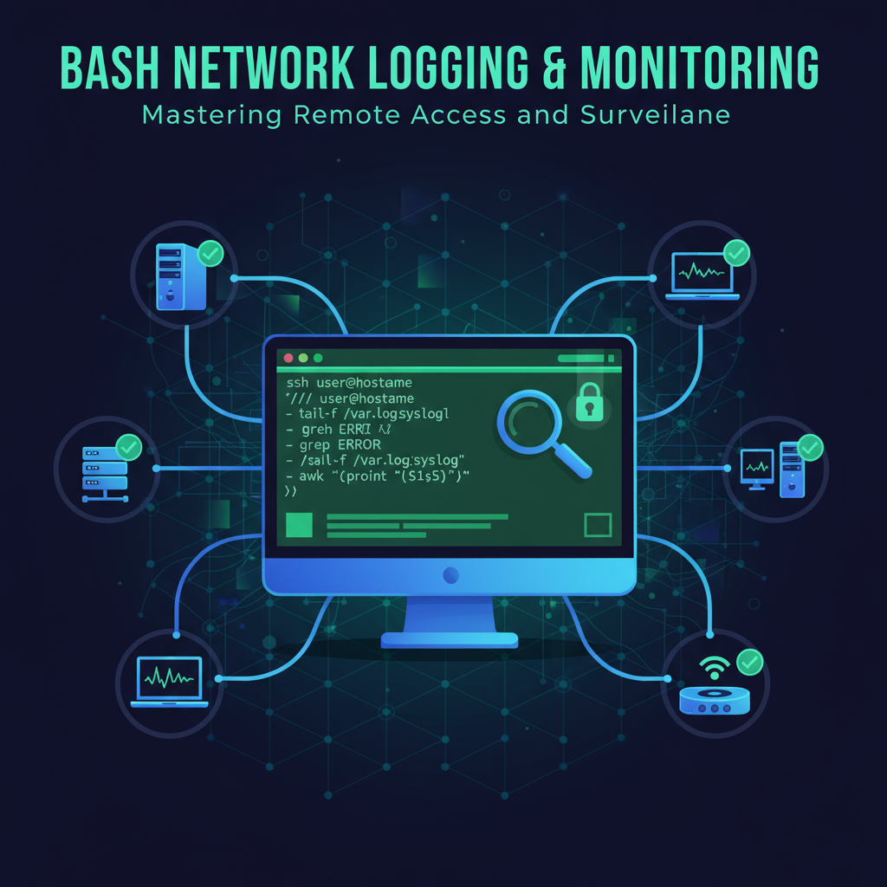

# Utilidades de bash

## Deploy simple

Una forma sencilla de hacer deploy y build de proyectos con git.

## Machine Specs

Un logger que extrae información de todas las máquinas que listo.

## MySQL Backups

Un script para crear backups durante los ultimos X días.

## MySQL Sync

Sincroniza dos bases de datos para dejarlas en el mismo estado.

## SCP files

Copiar ficheros de un servidor a otro de forma "segura".# bash_utilidades
